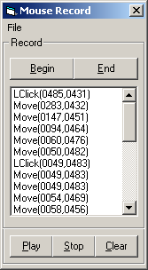



## Mouse Record

### Description

Fully commented. This program allows the user to record and playback mouse movements and clicks. When recording, it adds the mouse's coordinates and what the mouse is doing (moving, clicking) to a list. Then the program scrolls through the list and follows the scripts instructions on where to move and what to do.
 
### More Info
 

             |
---                |---
**Submitted On**   |2005-01-02 02:17:10
**By**             |[tazrockon](https://github.com/Planet-Source-Code/PSCIndex/blob/master/ByAuthor/tazrockon.md)
**Level**          |Intermediate
**User Rating**    |4.2 (25 globes from 6 users)
**Compatibility**  |VB 6\.0
**Category**       |[Complete Applications](https://github.com/Planet-Source-Code/PSCIndex/blob/master/ByCategory/complete-applications__1-27.md)
**World**          |[Visual Basic](https://github.com/Planet-Source-Code/PSCIndex/blob/master/ByWorld/visual-basic.md)
**Archive File**   |[Mouse\_Reco183580122005\.zip](https://github.com/Planet-Source-Code/tazrockon-mouse-record__1-58064/archive/master.zip)

